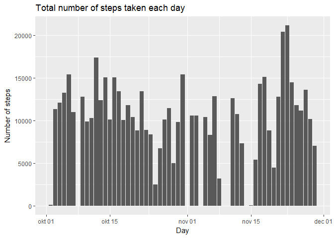
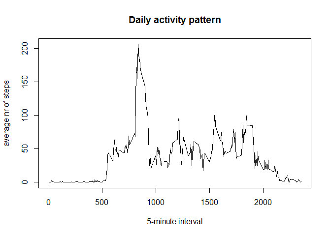
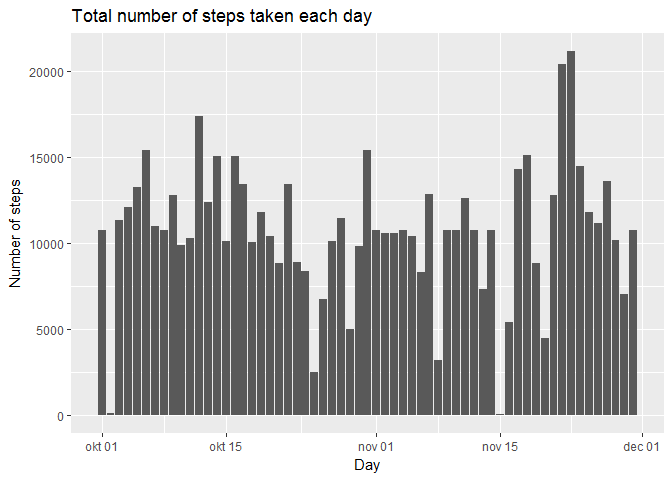
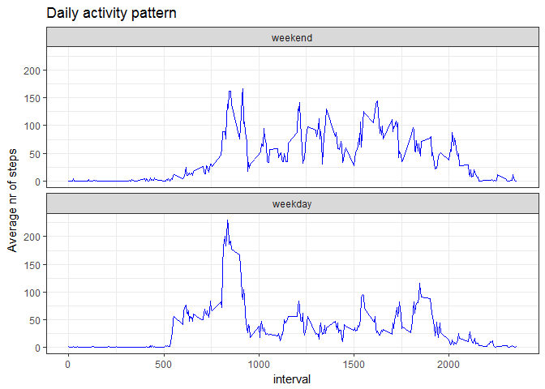

# Course Project 1 - Reproducible Research


## Loading and preprocessing the data


```r
activity <- read.csv("activity.csv",nrows = 17568)
activity$date <- as.Date(as.character(activity$date))
str(activity)
```

```
## 'data.frame':	17568 obs. of  3 variables:
##  $ steps   : int  NA NA NA NA NA NA NA NA NA NA ...
##  $ date    : Date, format: "2012-10-01" "2012-10-01" ...
##  $ interval: int  0 5 10 15 20 25 30 35 40 45 ...
```

## What is mean total number of steps taken per day?
1. Calculate the total number of steps taken per day:

```r
library(dplyr)
tmp1 <- tbl_df(activity) %>% group_by(date) %>% summarise(Tot_steps_day = sum(steps))
```

2. Make a histogram of the total number of steps taken each day:

```r
library(ggplot2)
g <- ggplot(tmp1,aes(date,Tot_steps_day))
g+geom_histogram(stat="identity") +ggtitle("Total number of steps taken each day")+xlab("Day")+ylab("Number of steps")
```

<!-- -->

3. Calculate and report the mean and median of the total number of steps taken per day

```r
Mean_steps_day <- round(mean(tmp1$Tot_steps_day,na.rm=TRUE))
Mean_steps_day
```

```
## [1] 10766
```

```r
Median_steps_day <- median(tmp1$Tot_steps_day,na.rm=TRUE)
Median_steps_day
```

```
## [1] 10765
```

Answers:
Mean total number of steps taken per day: 1.0766\times 10^{4}
Median of the total number of steps taken per day: 10765

## What is the average daily activity pattern?
1. Make a time series plot (i.e. type = "l") of the 5-minute interval (x-axis) and the average number of steps taken, 
averaged across all days (y-axis):

```r
tmp2 <- tbl_df(activity) %>% group_by(interval) %>% summarise(Mean_steps_int = mean(steps,na.rm=TRUE))
plot(tmp2$interval,tmp2$Mean_steps_int,type="l",xlab = "5-minute interval", ylab = "average nr of steps", main="Daily activity pattern")
```

<!-- -->

2. Which 5-minute interval, on average across all the days in the dataset, contains the maximum number of steps?

```r
Max_steps_int <- max(tmp2$Mean_steps_int)
Max_interval <- tmp2 %>% filter(Mean_steps_int == Max_steps_int)
Max_interval[1,1] 
```

```
## # A tibble: 1 × 1
##   interval
##      <int>
## 1      835
```

Answer: interval 835 contains the maximum number of steps

## Imputing missing values
1. Calculate and report the total number of missing values in the dataset (i.e. the total number of rows with NAs)

```r
Tot_NAs <- sum(is.na(activity$steps))
Tot_NAs
```

```
## [1] 2304
```
Answer: The total number of missing values in the dataset is 2304

2. Devise a strategy for filling in all of the missing values in the dataset.
For example, you could use the mean for that 5-minute interval (Note: I have called this: Mean_steps_int).
Step 2a: add Mean_steps_int to the original data (activity), using tmp2-dataframe from above:

```r
tmp3 <- inner_join(activity,tmp2,by="interval") 
```
Step 2b: filter on NAs ; overwrite steps with Mean_steps_int ; drop column Mean_steps_int :

```r
tmp4 <- tbl_df(tmp3) %>% filter(is.na(steps)) %>% mutate(steps = Mean_steps_int) %>% select(steps,date,interval)
```
3. Create a new dataset that is equal to the original dataset but with the missing data filled in.
Step 3a: rowbind tmp4 to the originial dataset. First subset original data on !is.na():

```r
tmp5 <- activity[!(is.na(activity$steps)),]
tmp6<- rbind(tmp4,tmp5)
str(tmp6)
```

```
## Classes 'tbl_df', 'tbl' and 'data.frame':	17568 obs. of  3 variables:
##  $ steps   : num  1.717 0.3396 0.1321 0.1509 0.0755 ...
##  $ date    : Date, format: "2012-10-01" "2012-10-01" ...
##  $ interval: int  0 5 10 15 20 25 30 35 40 45 ...
```

4a. Make a histogram of the total number of steps taken each day

```r
tmp1b <- tbl_df(tmp6) %>%
    group_by(date) %>%
    summarise(Tot_steps_day = sum(steps))
g <- ggplot(tmp1b,aes(date,Tot_steps_day))
g+geom_histogram(stat="identity") +ggtitle("Total number of steps taken each day")+xlab("Day")+ylab("Number of steps")
```

<!-- -->

4b. Calculate and report the mean and median total number of steps taken per day. 

```r
tmp7 <- tbl_df(tmp6) %>% group_by(date) %>% summarise(Tot_steps_day_2 = sum(steps))
Mean_steps_day_2<- round(mean(tmp7$Tot_steps_day_2))
Mean_steps_day_2
```

```
## [1] 10766
```

```r
Median_steps_day_2 <- median(tmp7$Tot_steps_day_2)
Median_steps_day_2
```

```
## [1] 10766.19
```

Answers:
Mean total number of steps taken per day: 1.0766\times 10^{4}
Median of the total number of steps taken per day: 1.0766189\times 10^{4}

4c.Do these values differ from the estimates from the first part of the assignment? What is the impact of imputing missing data on the estimates of the total daily number of steps?

```r
delta_Mean <- Mean_steps_day_2 - Mean_steps_day
delta_Mean 
```

```
## [1] 0
```

```r
delta_Median <- Median_steps_day_2 - Median_steps_day
delta_Median
```

```
## [1] 1.188679
```

Answers: 
difference in Mean is 0
and difference in Median is 1.1886792

## Are there differences in activity patterns between weekdays and weekends?
1.Create a new factor variable in the dataset with two levels - "weekday" and "weekend" indicating whether a given date is a weekday or weekend day.


```r
Sys.setlocale("LC_TIME", "English")
```

```
## [1] "English_United States.1252"
```

```r
tmp6$weekday <- weekdays(tmp6$date) 
unique(tmp6$weekday) 
```

```
## [1] "Monday"    "Thursday"  "Sunday"    "Friday"    "Saturday"  "Wednesday"
## [7] "Tuesday"
```

```r
#create factor variable (with TRUE for weekdays and FALSE for weekends):
tmp6$day_indicator <- as.factor(!(tmp6$weekday == ("Saturday") | tmp6$weekday == ("Sunday")))
#change factor labels:
levels(tmp6$day_indicator) <- c("weekend", "weekday")
str(tmp6)
```

```
## Classes 'tbl_df', 'tbl' and 'data.frame':	17568 obs. of  5 variables:
##  $ steps        : num  1.717 0.3396 0.1321 0.1509 0.0755 ...
##  $ date         : Date, format: "2012-10-01" "2012-10-01" ...
##  $ interval     : int  0 5 10 15 20 25 30 35 40 45 ...
##  $ weekday      : chr  "Monday" "Monday" "Monday" "Monday" ...
##  $ day_indicator: Factor w/ 2 levels "weekend","weekday": 2 2 2 2 2 2 2 2 2 2 ...
```

2.Make a panel plot containing a time series plot (i.e. type = "l") of the 5-minute interval (x-axis) 
and the average number of steps taken, averaged across all weekday days or weekend days (y-axis). 


```r
tmp8 <- tbl_df(tmp6) %>%
    group_by(day_indicator,interval) %>%
    summarise(Mean_steps_int = mean(steps,na.rm=TRUE))
g<- ggplot(tmp8,aes(interval,Mean_steps_int))
g+facet_grid(day_indicator~.)+geom_line(color="blue")+ggtitle("Daily activity pattern")+
    ylab("Average nr of steps")+facet_wrap(~day_indicator,ncol=1)+theme_bw()
```

<!-- -->

